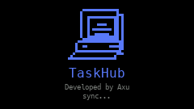
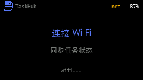
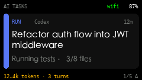
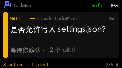
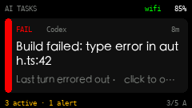
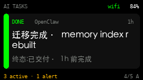
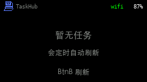
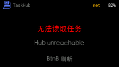
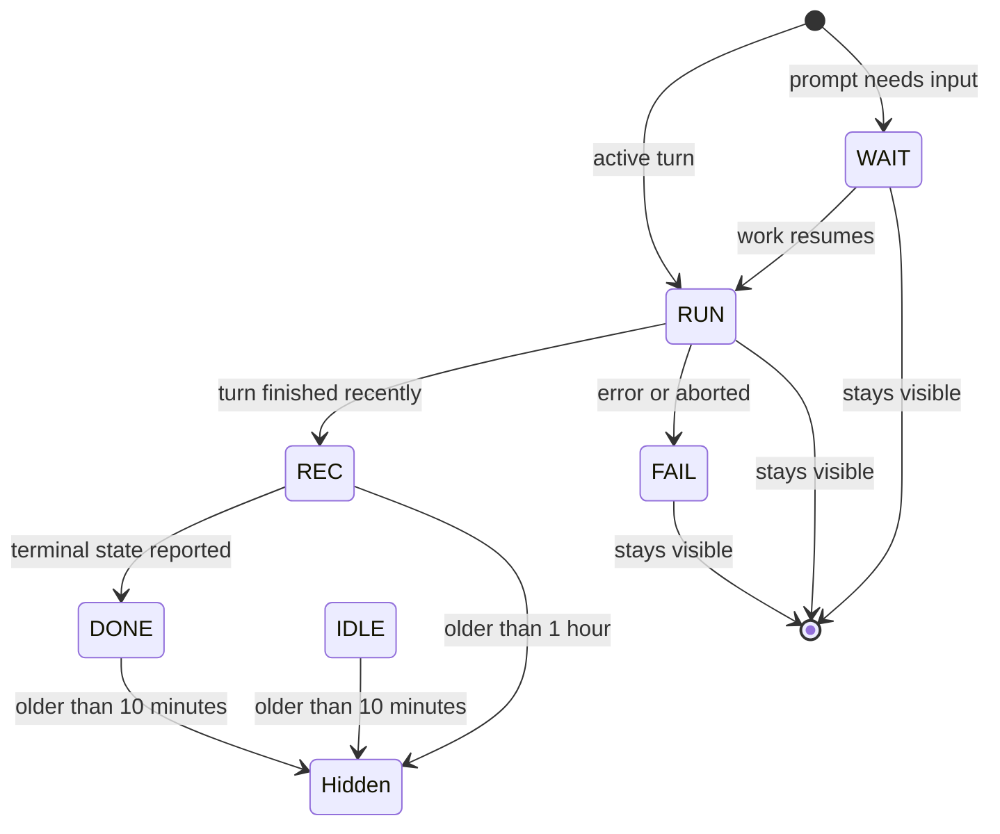
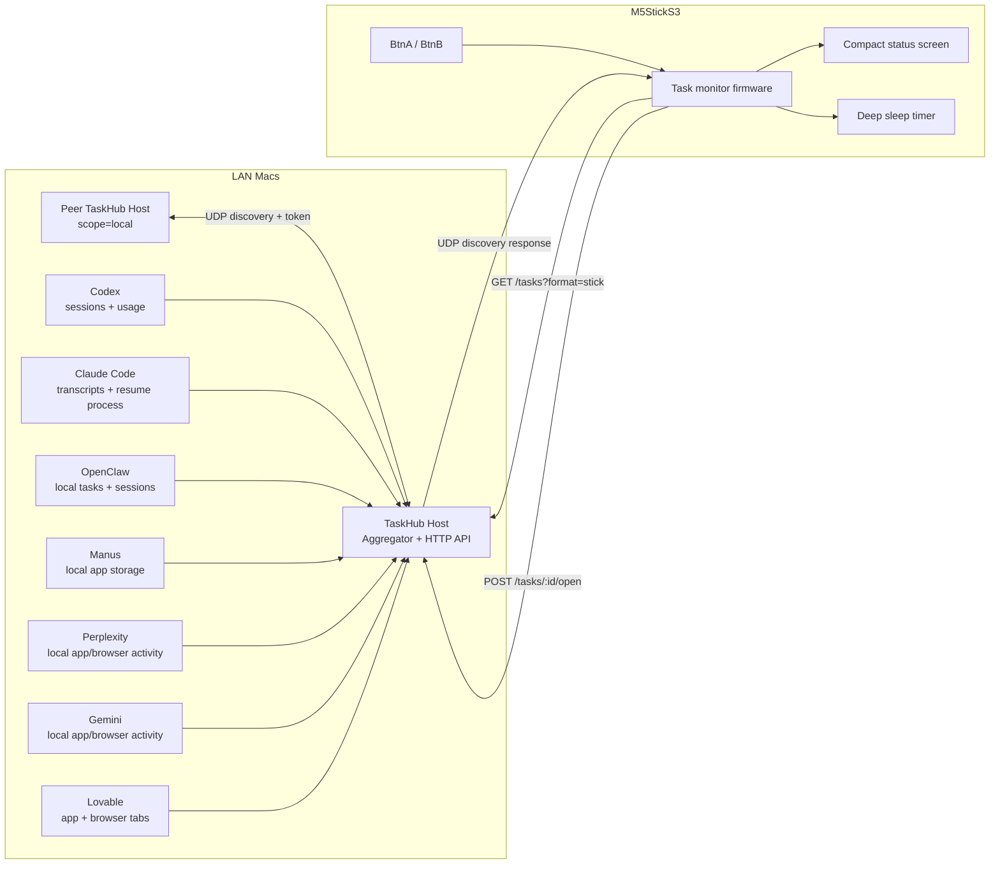

# TaskHub for StickS3

A pocket hardware dashboard for AI agent work across your Macs.

[简体中文](README.zh-CN.md) | [Installation](INSTALL.md)

[](https://github.com/sheepxux/Taskhub-for-StickS3/actions/workflows/ci.yml)
[](CHANGELOG.md)
[](firmware/task_monitor)
[](host)
[](#privacy-and-security)
[](LICENSE)

TaskHub for StickS3 turns an M5StickS3 into a tiny always-nearby status screen
for AI coding agents, desktop AI apps, and browser-based agent tools. A local
Mac Host reads task metadata from sources such as Codex, Claude Code, OpenClaw,
Manus, Perplexity, Gemini, and Lovable, discovers other authorized TaskHub Hosts
on the same LAN, then sends a compact task list to the StickS3 over Wi-Fi.

The device shows which task is running, which one needs your input, what
recently finished, and token or turn usage when the source exposes it. BtnB can
open the source app on the Mac, BtnA switches tasks, and the firmware sleeps
between refreshes so the small StickS3 battery remains usable.

## Why It Exists

AI agents are easy to start and easy to forget. TaskHub gives them a physical
status surface:

- See active AI work without switching windows.
- Catch Codex or Claude Code prompts when they need a reply.
- Track tasks across more than one Mac on the same Wi-Fi.
- Keep task state local instead of sending agent metadata to a cloud service.
- Use a small, inexpensive device instead of dedicating another monitor.

## Screens

Pixel-accurate renders of what the StickS3 draws at its native 240x135
resolution. Regenerate them with `python3 docs/render_screens.py`.

<table>
  <tr>
    <td align="center"><br/><sub><b>BOOT</b> - Wi-Fi sync splash</sub></td>
    <td align="center"><br/><sub><b>WAKE</b> - reconnect after sleep</sub></td>
  </tr>
  <tr>
    <td align="center"><br/><sub><b>RUN</b> - active agent turn</sub></td>
    <td align="center"><br/><sub><b>WAIT</b> - needs your input</sub></td>
  </tr>
  <tr>
    <td align="center"><br/><sub><b>FAIL</b> - error or attention</sub></td>
    <td align="center"><br/><sub><b>DONE</b> - finished task</sub></td>
  </tr>
  <tr>
    <td align="center"><br/><sub>No tasks - idle hub</sub></td>
    <td align="center"><br/><sub>Hub unreachable - Wi-Fi lost</sub></td>
  </tr>
</table>

## Current Release

`v2.0.3` is the current public build for developers and hardware makers. The
core pipeline is working: Mac Host, StickS3 firmware, Wi-Fi discovery, compact
task display, button actions, deep sleep, voice input, and LAN multi-device
aggregation.

Some AI apps expose rich local task logs; others expose only app activity or
visible browser UI. TaskHub is explicit about that distinction so users know
when a row is exact task tracking versus best-effort local signal detection.

## Feature Matrix

| Area | Status | Notes |
| --- | --- | --- |
| StickS3 firmware | Ready | Native 240x135 UI, buttons, Wi-Fi discovery, deep sleep |
| M5Burner public firmware | Ready | Builds without local secrets; first use is configured over USB into device NVS |
| macOS Host | Ready | LaunchAgent installer, local HTTP API, UDP discovery |
| Multi-Mac aggregation | Ready | Authorized Hosts discover peers and merge task lists |
| BtnB open source | Ready | Opens local source app; remote tasks forward to the origin Mac |
| WAIT attention mode | Ready | Keeps the display awake while a task needs user input |
| WAIT alert | Ready | Edge-triggered screen wake + short double beep when a task first needs input (`ALERT_*` tunable) |
| DONE alert | Ready | Edge-triggered softer rising chime when a running task finishes |
| Battery-aware operation | Ready | Sleeps by default, short timer-wake screen time, low brightness |
| Auto-rotation | Ready | IMU gravity rotates the screen to match how it's held; portrait shows a multi-task list (`ROTATE_*` tunable) |
| Voice input | Ready | Hold BtnB to dictate (Mandarin/English) → local whisper.cpp → text pasted and sent in the selected task's app (`POST /voice?enter=1`) |
| Codex adapter | Detailed | Tracks title, folder, turns, token usage, running/wait state |
| Claude Code adapter | Detailed | Tracks transcript turn state, prompts, usage, resume process |
| OpenClaw adapter | Detailed | Reads local task/session stores |
| Manus adapter | Best effort | Reads local app storage and usage counters when available |
| Perplexity adapter | Activity | Local app/browser activity; exact Perplexity Computer tasks are not guaranteed |
| Gemini adapter | Activity | App/web activity and visible browser title when exposed |
| Lovable adapter | Activity | App/browser activity, renderer CPU, visible generation controls |
| Browser web bridge | Optional | `extension/` (Chrome/Edge) reads Gemini/Lovable/Perplexity tab titles and pushes them via `POST /ingest` |
| External push API | Ready | `POST /ingest` accepts tasks from any local script; entries expire on a TTL |

## Browser Web Bridge (optional)

Browser-based AI tools keep task data on their servers, so the Host can only see
them as "active". The optional Chrome/Edge extension in [`extension/`](extension)
reads the open Gemini / Lovable / Perplexity tab's title and pushes it to the
Host via `POST /ingest`, so those tasks show real titles on the StickS3. It is
local-only (talks to `127.0.0.1`) and best-effort (page selectors fall back to
the tab title). See [extension/README.md](extension/README.md) to load it.

Any script can push too:

```bash
curl -X POST -H 'X-Device-Token: <token>' http://127.0.0.1:5577/ingest \
  -d '{"source":"Manus","title":"Draft weekly report","status":"running","ttl_sec":120}'
```

## Voice Mode

Hold **BtnB** on the StickS3 to dictate into the AI app you're working with —
Mandarin or English, transcribed locally, pasted into the chat box, and sent by
default.

1. Short-press BtnB to open a task's app (brings e.g. Claude to the front).
2. **Hold BtnB** and speak; release to transcribe and send.
3. The clip is POSTed to `POST /voice`, transcribed by a resident whisper.cpp
   server (`large-v3-turbo-q5_0`, Simplified Chinese + English), and pasted into
   the task's app. `?task=<id>` targets that app deterministically, and
   `?enter=1` submits the text with Return.

Everything stays local — the audio never leaves your machine/LAN.

One-time setup:

```bash
brew install whisper-cpp
mkdir -p host/models && curl -L -o host/models/ggml-large-v3-turbo-q5_0.bin \
  https://huggingface.co/ggerganov/whisper.cpp/resolve/main/ggml-large-v3-turbo-q5_0.bin
./host/install_whisper_server.sh   # resident whisper-server LaunchAgent on :8080
```

Grant the Host **Accessibility** permission (System Settings → Privacy & Security →
Accessibility) so it can paste into other apps. Tunables: `TASK_HUB_WHISPER_MODEL`,
`TASK_HUB_WHISPER_LANGUAGE` (`auto`/`zh`/`en`). Device-side auto-send is on by
default; set `VOICE_AUTO_SEND 0`, `TASKHUB_VOICE_SEND=0`, or provision with
`--voice-send off` if you want paste-only review before sending. Targeting works
for Claude, Codex, Manus, and Perplexity desktop apps.

## Status Model

TaskHub keeps the full task list on the Mac. The StickS3 applies a
display-only filter so old rows disappear from the tiny screen without deleting
anything from the computer.

| Label | Color intent | Meaning | StickS3 visibility |
| --- | --- | --- | --- |
| `RUN` | Blue | Active task or active agent turn | Always visible |
| `WAIT` | Yellow | Waiting for user input or queued attention | Always visible, keeps screen awake, and fires a one-shot wake + double-beep alert on entry |
| `FAIL` | Red | Failed or needs attention | Always visible |
| `DONE` | Green | Completed | Hidden after 10 minutes by default; a running-to-finished edge plays a softer chime |
| `REC` | White/gray | Recently active | Hidden after 1 hour by default |
| `IDLE` | Dark gray | Source is idle | Hidden after 10 minutes by default |
| `HIDDEN` | Gray/black | Display-only stale row | Not shown on device |



## Architecture



## Quick Start

For the full installation guide, see [INSTALL.md](INSTALL.md).

There are two supported install paths:

- **Developer/source flash**: clone the repo, create `secrets.h`, compile, and
  upload from Arduino CLI.
- **M5Burner/public firmware**: burn the public firmware, install the Mac Host,
  then run USB provisioning once to store Wi-Fi and the shared token on the
  StickS3.

### 1. Install requirements

- macOS
- M5StickS3
- Python 3
- `arduino-cli`
- ESP32 Arduino core
- Arduino libraries: `M5Unified`, `ArduinoJson`
- Optional: Node.js, used by the Host to read some local LevelDB app stores

### 2. Install the Mac Host

```bash
git clone https://github.com/sheepxux/Taskhub-for-StickS3.git
cd Taskhub-for-StickS3
./scripts/setup.sh
```

Check the Host:

```bash
curl http://127.0.0.1:5577/health
```

The installer copies the Host to:

```text
~/Library/Application Support/StickS3TaskHub
```

It also creates or reuses the device token at:

```text
~/Library/Application Support/StickS3TaskHub/token
```

The setup helper installs or repairs the Host, creates
`firmware/task_monitor/secrets.h`, syncs the shared token, and prompts for Wi-Fi
values if needed.

To install Arduino dependencies and compile firmware:

```bash
./scripts/setup.sh --deps --compile
```

To compile and upload while the StickS3 is plugged in:

```bash
./scripts/setup.sh --deps --upload
```

### 3. M5Burner / public firmware setup

The M5Burner build does **not** compile `secrets.h` into the binary. After
burning it, the StickS3 shows `USB Setup` until you provision it:

```bash
./scripts/setup.sh --skip-firmware --provision
```

That installs or repairs the Mac Host, reads the Host token, prompts for Wi-Fi
if needed, and sends the config to the StickS3 over USB. The firmware saves it
to NVS and restarts.

The device UI defaults to English. To switch fixed UI text to Chinese during
USB provisioning:

```bash
./scripts/setup.sh --skip-firmware --provision --lang zh
```

Build a public firmware artifact set for M5Burner publishing with:

```bash
./firmware/build_m5burner_public.sh
```

### 4. Configure the firmware manually

```bash
cp firmware/task_monitor/secrets.h.example firmware/task_monitor/secrets.h
```

Edit `firmware/task_monitor/secrets.h`:

```cpp
#define WIFI_SSID       "your-wifi-ssid"
#define WIFI_PASSWORD   "your-wifi-password"
#define DEVICE_TOKEN    "same-token-as-the-mac-host"
#define TASKHUB_LANG    "en"  // or "zh"
```

`TASK_HUB_HOST` is only a fallback. The firmware first tries UDP discovery on
port `5578`, so the Mac IP can change.

### 5. Flash the StickS3

```bash
./firmware/flash_task_monitor.sh all
```

After flashing, the StickS3 boots into the TaskHub logo screen, connects to
Wi-Fi, discovers the Mac Host, fetches tasks, then enters deep sleep after the
interactive timeout.

## Controls

| Control | Action |
| --- | --- |
| BtnB | Open the selected task's source app on the Mac |
| BtnB hold | Voice input — hold to talk, release to dictate and send in the task's app |
| BtnA | Select the next task |
| BtnA hold | Refresh immediately |

## Multi-Device Mode

Install the Mac Host on every Mac you want to include and use the same token on
each Host. Any TaskHub Host can act as the aggregator:

- Hosts announce themselves over UDP port `5578`.
- The aggregator fetches each peer's `/tasks?scope=local` list.
- Compact StickS3 rows include a short device label, such as `Codex@MBP`.
- BtnB on a remote task forwards the open request back to the Mac that owns it.

Useful environment variables:

| Variable | Default | Purpose |
| --- | --- | --- |
| `TASK_HUB_DEVICE_NAME` | macOS hostname | Human-readable device name |
| `TASK_HUB_DEVICE_ID` | stable host hash | Stable LAN peer identity |
| `TASK_HUB_ENABLE_PEERS` | `1` | Set to `0` to disable peer aggregation |
| `TASK_HUB_PEER_DISCOVERY_MS` | `15000` | UDP peer discovery interval |
| `TASK_HUB_PEER_CACHE_MS` | `5000` | Remote task cache duration |

Diagnostics:

```bash
open http://127.0.0.1:5577/peers
curl http://127.0.0.1:5577/peers.json?refresh=1
```

## Local API

| Endpoint | Purpose |
| --- | --- |
| `/health` | Host status, version, LAN identity |
| `/tasks` | Full task list for the web/debug page |
| `/tasks?format=stick` | Compact payload used by the StickS3 |
| `/tasks?scope=local` | Local Mac tasks only, used by peer aggregation |
| `/tasks/:id` | Local detail/debug page |
| `/tasks/:id/open` | Open selected source from the StickS3 |
| `/tasks/:id/open-native` | Host-to-host remote open forwarding |
| `/voice` | Transcribe a posted audio clip and paste it into a target app (voice mode) |
| `/peers` | Human-readable multi-device diagnostics |
| `/peers.json` | Machine-readable peer status |
| `/debug/lovable` | Lovable app/browser signal diagnostics |

## Power Profile

The firmware is battery-first by default. It wakes, fetches once, stays visible
briefly, then sleeps again. Active and WAIT tasks refresh more often.

| Setting | Default |
| --- | --- |
| Normal timer wake | `AUTO_WAKE_SECONDS=600` |
| Active/attention timer wake | `ACTIVE_WAKE_SECONDS=60` |
| Low-battery timer wake | `LOW_BATTERY_WAKE_SECONDS=900` |
| Timer-wake screen time | `QUIET_TIMER_TIMEOUT_MS=3000` |
| Button-wake screen time | `INTERACTIVE_TIMEOUT_MS=10000` |
| Normal brightness | `DISPLAY_BRIGHTNESS=32` |
| Low-battery brightness | `LOW_BATTERY_BRIGHTNESS=16` |
| CPU clock | `POWER_SAVE_CPU_MHZ=80` |
| Charge current | `CHARGE_CURRENT_MA=200` |

A WAIT almost always follows a running task, so the device is usually deep-sleeping
with an active task when one appears. `ACTIVE_WAKE_SECONDS=60` caps how long a new
WAIT can go unnoticed to ~1 minute while staying battery-first; raise it to trade
latency for battery life.

The on-device WAIT/DONE alerts are tunable in `firmware/task_monitor/secrets.h`:

| Setting | Default | Purpose |
| --- | --- | --- |
| `ALERT_ON_WAIT` | `1` | Master switch for the WAIT alert |
| `ALERT_ON_DONE` | `1` | Master switch for the DONE chime |
| `ALERT_BEEP` | `1` | Speaker beep/chime; set `0` for silent screen-only alerts |
| `ALERT_WAIT_HZ` / `ALERT_DONE_HZ` | `2400` / `1500` | WAIT double-beep pitch and DONE base pitch |
| `ALERT_BEEP_VOLUME` | `150` | Shared speaker loudness |

> Vibration: the M5StickS3 is not driven as a motor by the pinned M5Unified, so
> `ALERT_VIBRATION` is a no-op on this board and stays off — the alert uses the
> screen and speaker instead.

For UI or network debugging, set `ENABLE_DEEP_SLEEP` to `0` in
`firmware/task_monitor/secrets.h`. Re-enable it before normal use.

## Source Accuracy

TaskHub uses local data only. Accuracy depends on what each source exposes on
disk, through local process state, or through visible browser UI.

| Source | What is usually available |
| --- | --- |
| Codex | Task title, folder, turn state, token usage, running/wait status |
| Claude Code | Transcript state, prompt/wait detection, usage, resume process |
| OpenClaw | Local task registry, session title, task state |
| Manus | Local session metadata, timestamps, status codes, usage counters |
| Perplexity | App/browser activity; exact Perplexity Computer task names may be unavailable |
| Gemini | App/browser activity; visible tab title when exposed by the browser |
| Lovable | App/browser activity, project tabs, renderer CPU, visible generation controls |

If an app is open but not actively generating or executing, TaskHub should show
`REC` or `IDLE`, not `RUN`.

## Privacy And Security

TaskHub is local-first.

- The StickS3 talks to your Mac Host on your LAN.
- The Host does not upload task data to a cloud service.
- Firmware Wi-Fi secrets live in `secrets.h`, which is gitignored.
- The StickS3 API does not return auth tokens or message bodies.
- LAN peers must use the same token to participate.
- Host-to-device traffic uses plain HTTP on your LAN; run TaskHub only on a
  trusted local network.
- Do not expose port `5577` or `5578` directly to the public internet.

## Troubleshooting

| Problem | Check |
| --- | --- |
| StickS3 cannot find the Host | Confirm Mac and StickS3 are on the same Wi-Fi, then check `/health` |
| `401` from the Host | Confirm `DEVICE_TOKEN` matches the Host token file |
| No peer Macs show up | Open `/peers.json?refresh=1`, check token match and UDP port `5578` |
| An app only shows `REC` | The app may expose activity but no active task signal |
| Lovable running state looks wrong | Open `/debug/lovable` and inspect renderer CPU/browser basis |
| Battery drains too quickly | Lower brightness, shorten timeouts, keep deep sleep enabled |
| Browser task title is missing | Give the browser accessibility permission or keep the tab visible |

## Development

Useful checks before publishing a build:

```bash
python3 -m unittest discover -s host/tests   # host adapter regression suite
python3 -m py_compile host/task_hub.py docs/render_screens.py
python3 docs/render_screens.py
./firmware/flash_task_monitor.sh compile
```

### Testing & CI

The host logic ships with a dependency-free `unittest` suite in
[`host/tests/`](host/tests) covering status derivation, WAIT detection,
case-insensitive process matching, token accounting, LRU scan memoisation, and
`/ingest` validation/expiry. [GitHub Actions](.github/workflows/ci.yml) runs the
suite, byte-compiles the Host, and compiles the firmware against the ESP32 core
on every push and pull request.

Repository layout:

```text
firmware/task_monitor/   StickS3 firmware
firmware/flash_task_monitor.sh
host/task_hub.py         Local macOS Host
host/taskhub_config.py   Host runtime configuration
host/install_task_hub.sh LaunchAgent installer/repair script
host/README.md           Host diagnostics and adapter notes
scripts/setup.sh         First-run setup helper
INSTALL.md               Full installation and troubleshooting guide
docs/                    Device screen renders
CHANGELOG.md             Release notes
```

## Roadmap

- Signed or packaged Mac installer.
- Recorded local-metadata fixtures to broaden the adapter regression suite.
- More detailed browser-task extraction for Gemini, Lovable, and Perplexity.
- FAIL alert tone distinct from the WAIT alert, plus an optional external buzzer.
- Better first-run setup flow for non-developer users.

## Release

Current release: `v2.0.3`.

See [CHANGELOG.md](CHANGELOG.md) for release notes.
