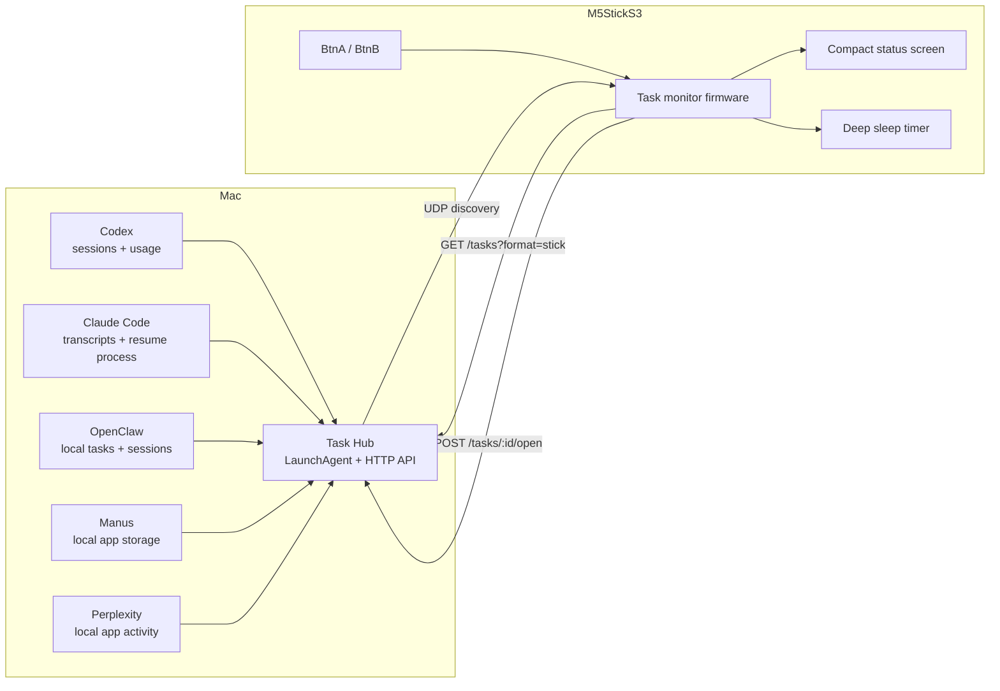
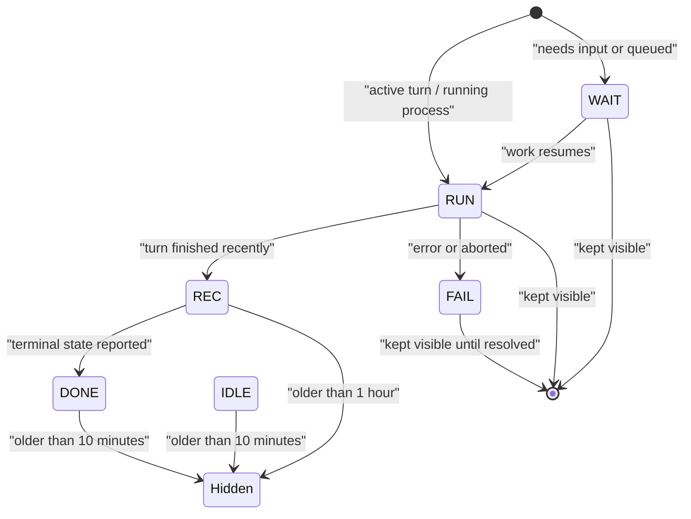

# TaskHub for StickS3

Tiny hardware status dashboard for local AI agents on your Mac.

[](CHANGELOG.md)
[](firmware/task_monitor)
[](host)
[](LICENSE)

TaskHub for StickS3 turns an M5StickS3 into a pocket-sized dashboard for the AI
work happening on your Mac. A local Mac hub collects task metadata from tools
such as Codex, Claude Code, OpenClaw, Manus, and Perplexity, then serves a
compact task list to the StickS3 over your LAN.

The device shows what is running, what recently finished, token or turn usage
when available, and can open the source app on your Mac with one button.

## What It Does

| Capability | Status |
| --- | --- |
| Local Mac hub with LaunchAgent installer | Ready |
| Wi-Fi discovery from StickS3 to Mac | Ready |
| Codex task, folder, turn, and token tracking | Ready |
| Claude Code turn-state and token tracking | Ready |
| OpenClaw local session/task tracking | Ready |
| Manus local session metadata and usage counters | Ready |
| Perplexity local activity indicator | Ready |
| BtnA open source app on Mac | Ready |
| BtnB task navigation and hold-to-refresh | Ready |
| Deep sleep and periodic wake refresh | Ready |

## Architecture



## Status Model

The Mac hub keeps the full task list. The StickS3 applies a display-only filter
so old tasks disappear from the tiny screen without deleting anything on your
Mac.



Compact status labels:

| Label | Meaning | StickS3 behavior |
| --- | --- | --- |
| `RUN` | Active task or active agent turn | Always visible |
| `WAIT` | Waiting for input or queued | Always visible |
| `FAIL` | Failed or needs attention | Always visible |
| `REC` | Recently active | Hidden after 1 hour |
| `DONE` | Completed | Hidden after 10 minutes |
| `IDLE` | App/source idle | Hidden after 10 minutes |

## Supported Sources

| Source | Local signal used |
| --- | --- |
| Codex | Session index, session JSONL logs, token usage, active turn markers |
| Claude Code | Local session metadata, transcript stop reasons, `claude --resume` process |
| OpenClaw | Local task registry and session stores |
| Manus | Local app storage, session timestamps, status codes, usage counters |
| Perplexity | Local preference/cache activity signals |

Perplexity does not expose a stable local task transcript, so TaskHub reports
local activity rather than exact task titles.

## Hardware

- M5StickS3
- macOS machine on the same Wi-Fi network
- USB cable for the first firmware flash

## Quick Start

Clone this repository, then install or repair the Mac hub:

```bash
./host/install_task_hub.sh
```

Configure the firmware:

```bash
cp firmware/task_monitor/secrets.h.example firmware/task_monitor/secrets.h
```

Edit `firmware/task_monitor/secrets.h` and set:

- `WIFI_SSID`
- `WIFI_PASSWORD`
- `DEVICE_TOKEN`

The `DEVICE_TOKEN` must match the token in:

```text
~/Library/Application Support/StickS3TaskHub/token
```

Build and flash the StickS3:

```bash
./firmware/flash_task_monitor.sh upload
```

After flashing, the StickS3 discovers the Mac hub over UDP, fetches the compact
task list, shows it briefly, then enters deep sleep. It wakes on button press or
every `AUTO_WAKE_SECONDS`.

## Controls

| Control | Action |
| --- | --- |
| BtnA | Open the selected task's source app on the Mac |
| BtnB | Select the next task |
| BtnB hold | Refresh immediately |

## Privacy

TaskHub is local-first by design.

- The StickS3 talks only to your Mac hub on your LAN.
- The hub does not upload task data to a cloud service.
- Firmware secrets are stored in `secrets.h`, which is gitignored.
- Auth tokens and message bodies are not returned by the StickS3 API.
- Adapters read only the local metadata needed to derive task state.

## Requirements

- macOS
- Python 3
- `arduino-cli`
- ESP32 Arduino core
- M5Unified and ArduinoJson libraries
- Node.js is optional but recommended for Manus local LevelDB parsing

## Repository Layout

```text
firmware/task_monitor/   StickS3 firmware
host/task_hub.py         Local Mac hub
host/install_task_hub.sh LaunchAgent installer/repair script
host/README.md           Hub development and diagnostic notes
```

## Release

Current release: `v1.0.0`.

See [CHANGELOG.md](CHANGELOG.md) for release notes.
