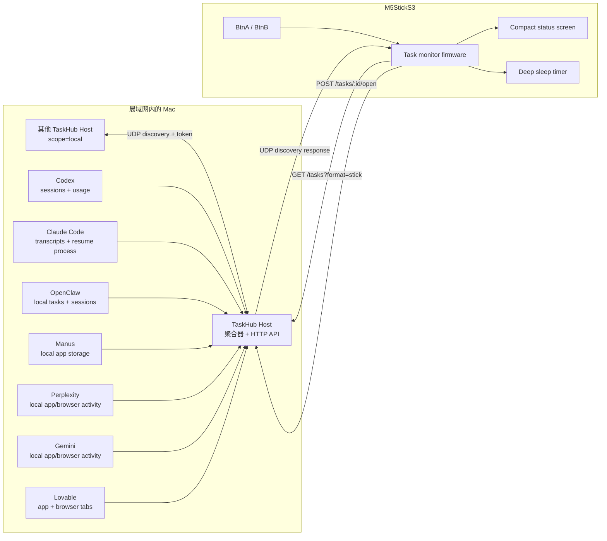

# TaskHub for StickS3

一个放在桌面上的 AI 任务硬件状态屏。

[English](README.md) | 简体中文 | [安装说明](INSTALL.md)

[](https://github.com/sheepxux/Taskhub-for-StickS3/actions/workflows/ci.yml)
[](CHANGELOG.md)
[](firmware/task_monitor)
[](host)
[](#隐私与安全)
[](LICENSE)

TaskHub for StickS3 可以把 M5StickS3 变成一个小型 AI Agent 状态屏。
Mac 上的 TaskHub Host 会读取 Codex、Claude Code、OpenClaw、Manus、
Perplexity、Gemini、Lovable 等工具的本地任务状态，发现同一局域网内
其他授权 Host，然后把精简后的任务列表通过 Wi-Fi 发送给 StickS3。

设备可以显示哪个任务正在运行、哪个任务正在等待你回复、哪些任务刚完成，
并在来源支持时显示 token 或回合信息。BtnA 可以打开任务来源 App，BtnB
切换任务，固件默认会在刷新后进入深度睡眠，尽量照顾 StickS3 的小电池。

## 为什么做

AI Agent 越来越容易同时开很多个，但也越来越容易忘记它们正在做什么。
TaskHub 的目标是给这些后台任务一个实体状态面板：

- 不切窗口也能看到 AI 是否还在跑。
- Codex 或 Claude Code 等你回复时，桌面小屏会提醒你。
- 同一个 Wi-Fi 下可以聚合多台 Mac 的任务。
- 所有状态都在本地读取和传输，不上传到云端服务。
- 用一个小硬件替代常驻打开的监控窗口。

## 设备画面

下面是 StickS3 原生 240x135 分辨率的像素级渲染图，可用
`python3 docs/render_screens.py` 重新生成。

<table>
  <tr>
    <td align="center"><br/><sub><b>BOOT</b> - 开机连接 Wi-Fi</sub></td>
    <td align="center"><br/><sub><b>WAKE</b> - 睡眠后重连</sub></td>
  </tr>
  <tr>
    <td align="center"><br/><sub><b>RUN</b> - Agent 正在执行</sub></td>
    <td align="center"><br/><sub><b>WAIT</b> - 等待用户输入</sub></td>
  </tr>
  <tr>
    <td align="center"><br/><sub><b>FAIL</b> - 出错或需要注意</sub></td>
    <td align="center"><br/><sub><b>DONE</b> - 任务完成</sub></td>
  </tr>
  <tr>
    <td align="center"><br/><sub>暂无任务</sub></td>
    <td align="center"><br/><sub>无法连接 Host</sub></td>
  </tr>
</table>

## 当前版本

当前版本是 `v1.1.1`，适合作为开发者和 maker 的早期公开版本使用。

已经完成的核心链路包括：Mac Host、StickS3 固件、Wi-Fi 发现、精简任务显示、
按钮操作、深度睡眠、多 Mac 局域网聚合，以及多设备诊断页面。

需要注意：不同 AI 工具开放的本地信息不同。Codex、Claude Code、OpenClaw
这类工具可以做到更细的任务/回合追踪；Perplexity、Gemini、Lovable 这类
App 或网页工具，有些状态只能通过本地活动、进程、缓存、浏览器标题或可见
界面信号推断。

## 功能矩阵

| 模块 | 状态 | 说明 |
| --- | --- | --- |
| StickS3 固件 | Ready | 原生 240x135 UI、按钮、Wi-Fi 发现、深度睡眠 |
| macOS Host | Ready | LaunchAgent 安装、本地 HTTP API、UDP 发现 |
| 多 Mac 聚合 | Ready | 同 token Host 可互相发现并合并任务 |
| BtnA 打开来源 | Ready | 本机任务打开本机 App，远程任务转发到来源 Mac |
| WAIT 注意模式 | Ready | 任务等待输入时保持屏幕唤醒 |
| WAIT 提醒 | Ready | 任务首次需要输入时边沿触发：点亮屏幕 + 短促双蜂鸣（`ALERT_*` 可调） |
| DONE 提醒 | Ready | 运行任务完成时边沿触发：更柔和的上行提示音 |
| 省电策略 | Ready | 默认深度睡眠、低亮度、短暂显示 |
| Codex 适配器 | Detailed | 标题、文件夹、回合、token、运行/等待状态 |
| Claude Code 适配器 | Detailed | transcript 状态、等待提示、usage、resume 进程 |
| OpenClaw 适配器 | Detailed | 本地任务和 session 存储 |
| Manus 适配器 | Best effort | 本地 app storage 和 usage 计数 |
| Perplexity 适配器 | Activity | 本地 App/浏览器活动，Computer 任务标题不保证稳定 |
| Gemini 适配器 | Activity | App/网页活动，可见浏览器标题 |
| Lovable 适配器 | Activity | App/网页活动、renderer CPU、可见生成控件 |

## 状态模型

TaskHub 在 Mac 上保留完整任务列表。StickS3 只做显示层过滤：过旧任务会从
小屏幕上隐藏，但不会删除电脑上的任何数据。

| 标签 | 颜色意图 | 含义 | StickS3 显示策略 |
| --- | --- | --- | --- |
| `RUN` | 蓝色 | 正在运行或 Agent 正在执行回合 | 永远显示 |
| `WAIT` | 黄色 | 等待用户输入或需要注意 | 永远显示、保持屏幕唤醒，并在进入时触发一次提醒（点亮 + 双蜂鸣） |
| `FAIL` | 红色 | 失败或需要处理 | 永远显示 |
| `DONE` | 绿色 | 已完成 | 默认 10 分钟后隐藏；运行任务刚完成时播放柔和提示音 |
| `REC` | 白灰色 | 最近活动 | 默认 1 小时后隐藏 |
| `IDLE` | 深灰色 | 来源空闲 | 默认 10 分钟后隐藏 |
| `HIDDEN` | 灰黑色 | 仅设备端隐藏 | 不显示在设备上 |

## 架构



## 快速安装

完整安装说明见 [INSTALL.md](INSTALL.md)。

```bash
git clone https://github.com/sheepxux/Taskhub-for-StickS3.git
cd Taskhub-for-StickS3
./scripts/setup.sh
```

如果已经安装好 `arduino-cli`，可以直接编译固件：

```bash
./scripts/setup.sh --compile
```

如果希望脚本安装 ESP32 core 和 Arduino 依赖库：

```bash
./scripts/setup.sh --deps --compile
```

如果 StickS3 已经插入电脑，并且想直接刷机：

```bash
./scripts/setup.sh --deps --upload
```

## 手动安装概要

安装或修复 Mac Host：

```bash
./host/install_task_hub.sh
```

检查 Host：

```bash
curl http://127.0.0.1:5577/health
```

配置固件：

```bash
cp firmware/task_monitor/secrets.h.example firmware/task_monitor/secrets.h
```

编辑 `firmware/task_monitor/secrets.h`：

```cpp
#define WIFI_SSID       "your-wifi-ssid"
#define WIFI_PASSWORD   "your-wifi-password"
#define DEVICE_TOKEN    "same-token-as-the-mac-host"
```

刷入 StickS3：

```bash
./firmware/flash_task_monitor.sh all
```

## 按钮

| 操作 | 功能 |
| --- | --- |
| BtnA | 打开当前选中任务的来源 App |
| BtnB | 切换到下一个任务 |
| 长按 BtnB | 立即刷新 |

## 多设备模式

在每台需要纳入监控的 Mac 上安装 Host，并使用同一个 token。任意一台 Host
都可以作为聚合器：

- Host 通过 UDP `5578` 在局域网内互相发现。
- 聚合器读取其他 Host 的 `/tasks?scope=local`。
- StickS3 会显示类似 `Codex@MBP`、`Lovable@Studio` 的来源。
- BtnA 打开远程任务时，会把请求转发回任务所在的 Mac。

诊断页面：

```bash
open http://127.0.0.1:5577/peers
curl http://127.0.0.1:5577/peers.json?refresh=1
```

## 本地 API

| Endpoint | 用途 |
| --- | --- |
| `/health` | Host 状态、版本、局域网身份 |
| `/tasks` | 完整任务列表 |
| `/tasks?format=stick` | StickS3 使用的精简任务列表 |
| `/tasks?scope=local` | 仅本机任务，用于多设备聚合 |
| `/tasks/:id` | 本地任务详情/调试页 |
| `/tasks/:id/open` | 从 StickS3 打开任务来源 |
| `/tasks/:id/open-native` | Host 之间转发打开请求 |
| `/peers` | 多设备诊断页面 |
| `/peers.json` | 多设备诊断 JSON |
| `/debug/lovable` | Lovable 状态判断调试信息 |

## 省电策略

固件默认是省电优先：唤醒、拉取任务、短暂显示，然后进入深度睡眠。
有 `RUN` 或 `WAIT` 任务时会更频繁刷新。

| 设置 | 默认值 |
| --- | --- |
| 普通定时唤醒 | `AUTO_WAKE_SECONDS=600` |
| 活跃/注意任务唤醒 | `ACTIVE_WAKE_SECONDS=60` |
| 低电量唤醒 | `LOW_BATTERY_WAKE_SECONDS=900` |
| 定时唤醒亮屏时间 | `QUIET_TIMER_TIMEOUT_MS=3000` |
| 按钮唤醒亮屏时间 | `INTERACTIVE_TIMEOUT_MS=10000` |
| 普通亮度 | `DISPLAY_BRIGHTNESS=32` |
| 低电量亮度 | `LOW_BATTERY_BRIGHTNESS=16` |
| CPU 频率 | `POWER_SAVE_CPU_MHZ=80` |
| 充电电流 | `CHARGE_CURRENT_MA=200` |

WAIT 几乎总是在某个任务运行时出现，此时设备多半正深睡。`ACTIVE_WAKE_SECONDS=60`
把"新 WAIT 被发现"的最坏延迟压到约 1 分钟，同时保持省电优先；想更省电就调大。

设备端 WAIT/DONE 提醒可在 `firmware/task_monitor/secrets.h` 调整：

| 设置 | 默认值 | 作用 |
| --- | --- | --- |
| `ALERT_ON_WAIT` | `1` | WAIT 提醒总开关 |
| `ALERT_ON_DONE` | `1` | DONE 完成提示音总开关 |
| `ALERT_BEEP` | `1` | 蜂鸣/提示音；设 `0` 则只点亮屏幕、不出声 |
| `ALERT_WAIT_HZ` / `ALERT_DONE_HZ` | `2400` / `1500` | WAIT 双蜂鸣音调与 DONE 基础音调 |
| `ALERT_BEEP_VOLUME` | `150` | 共用扬声器音量 |

> 振动：当前固定版本的 M5Unified 不会把 M5StickS3 当作马达驱动，所以
> `ALERT_VIBRATION` 在本板上是空操作并默认关闭——提醒改用屏幕与扬声器。

调试 UI 或网络时，可以在 `firmware/task_monitor/secrets.h` 里把
`ENABLE_DEEP_SLEEP` 设为 `0`。正常使用前建议重新开启。

## 准确性边界

TaskHub 只读取本地数据。准确性取决于对应 AI 工具是否暴露了稳定的本地
日志、进程状态、缓存活动或浏览器可见 UI。

| 来源 | 通常能读取到的信息 |
| --- | --- |
| Codex | 任务标题、文件夹、回合状态、token、RUN/WAIT |
| Claude Code | transcript 状态、等待提示、usage、resume 进程 |
| OpenClaw | 本地任务 registry、session 标题、任务状态 |
| Manus | 本地 session 元数据、时间戳、状态码、usage |
| Perplexity | App/浏览器活动，精确任务标题不保证 |
| Gemini | App/浏览器活动，可见 tab 标题 |
| Lovable | App/浏览器活动、项目 tab、renderer CPU、可见生成控件 |

如果某个 App 只是打开着但没有真正生成或执行，TaskHub 应显示 `REC` 或
`IDLE`，而不是 `RUN`。

## 隐私与安全

TaskHub 是 local-first 设计：

- StickS3 只和局域网内的 Mac Host 通信。
- Host 不会把任务数据上传到云服务。
- Wi-Fi 密码保存在被 gitignore 的 `secrets.h`。
- StickS3 API 不返回 token 或消息正文。
- 局域网 Peer 必须使用相同 token 才能参与聚合。
- Host 到设备的通信使用局域网内明文 HTTP，只应在可信本地网络使用。
- 不要把 `5577` 或 `5578` 端口暴露到公网。

## 常见问题

| 问题 | 检查 |
| --- | --- |
| StickS3 找不到 Host | 确认同一 Wi-Fi，并打开 `/health` |
| 返回 `401` | 检查 `DEVICE_TOKEN` 是否和 Host token 一致 |
| 多 Mac 不显示 | 打开 `/peers.json?refresh=1`，检查 token 和 UDP `5578` |
| App 只显示 `REC` | 该 App 可能只暴露活动信号，没有稳定任务状态 |
| Lovable 状态不准 | 打开 `/debug/lovable` 看 renderer CPU 和 browser basis |
| 续航太差 | 降低亮度、缩短亮屏时间、保持深度睡眠开启 |
| 浏览器任务标题缺失 | 给浏览器或 Host 运行环境开启 Accessibility 权限 |

## 开发检查

发布前可以运行：

```bash
python3 -m unittest discover -s host/tests   # Host 适配器回归测试
python3 -m py_compile host/task_hub.py docs/render_screens.py
python3 docs/render_screens.py
./firmware/flash_task_monitor.sh compile
```

### 测试与 CI

Host 逻辑自带零依赖的 `unittest` 套件（[`host/tests/`](host/tests)），覆盖状态推导、
WAIT 检测、大小写无关的进程匹配、token 统计、LRU 缓存记忆化，以及 `/ingest` 的校验与
过期。[GitHub Actions](.github/workflows/ci.yml) 会在每次 push 和 PR 上运行测试、字节
编译 Host，并针对 ESP32 core 编译固件。

主要目录：

```text
host/task_hub.py         macOS Host 入口
host/taskhub_config.py   Host 运行配置
firmware/task_monitor/   StickS3 固件
extension/               Chrome/Edge Web Bridge
```

## Roadmap

- 更易用的 macOS 安装器。
- 录制本地元数据 fixture，扩展适配器回归测试。
- 加强 Gemini、Lovable、Perplexity 的浏览器任务提取。
- 区别于 WAIT 的 FAIL 提醒音，以及可选的外接蜂鸣器。
- 面向非开发者的一次性引导流程。

## Release

当前版本：`v1.1.1`。

更新记录见 [CHANGELOG.md](CHANGELOG.md)。
